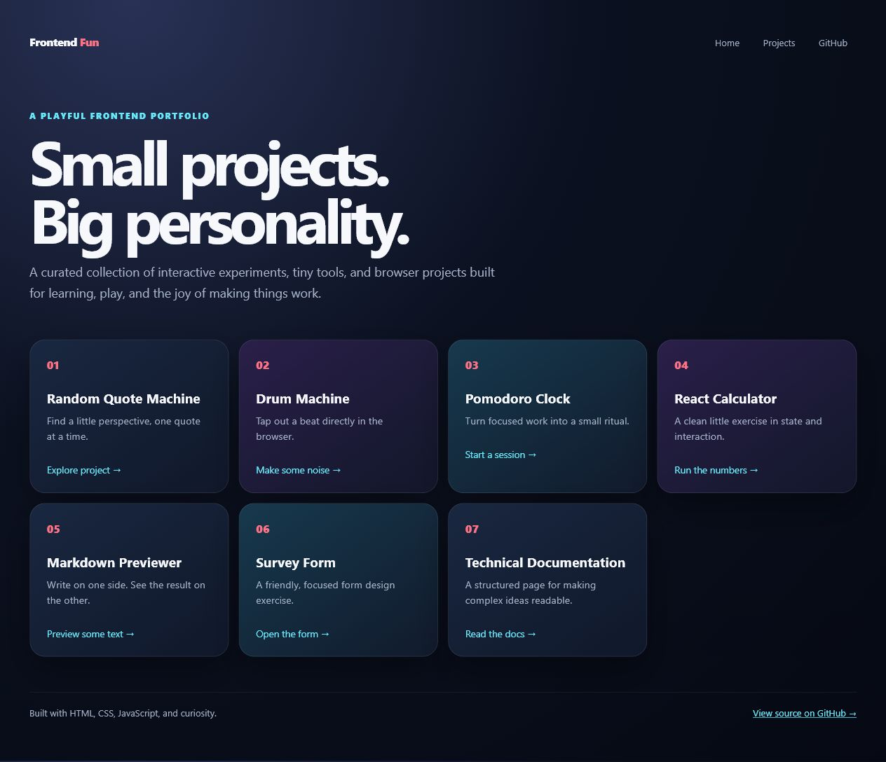

# Frontend Fun Projects

<p align="center"><strong>Small projects. Big personality.</strong><br>A curated gallery of interactive frontend experiments and browser mini-apps.</p>

## Explore the collection

| Project | Description | Demo |
| --- | --- | --- |
| **Random Quote Machine** | A little perspective, one quote at a time | [Open demo →](https://engrbugs.github.io/frontend-fun-projects/random-quote-machine/) |
| **Drum Machine** | Tap out a beat in the browser | [Open demo →](https://engrbugs.github.io/frontend-fun-projects/drum-machine/) |
| **Pomodoro Clock** | A small ritual for focused work | [Open demo →](https://engrbugs.github.io/frontend-fun-projects/pomodoro-clock/) |
| **React Calculator** | State and interaction in a compact app | [Open demo →](https://engrbugs.github.io/frontend-fun-projects/react-app-calculator/) |
| **Markdown Previewer** | Write on one side, preview on the other | [Open demo →](https://engrbugs.github.io/frontend-fun-projects/markdown-previewer/) |
| **Survey Form** | A focused form-design exercise | [Open demo →](https://engrbugs.github.io/frontend-fun-projects/SurveyForm/) |
| **Technical Documentation** | Making complex ideas easier to read | [Open demo →](https://engrbugs.github.io/frontend-fun-projects/TechnicalDocumentation/) |

## Visual preview

[](https://engrbugs.github.io/frontend-fun-projects/)

_Click the preview to open the live gallery._

## Repository structure

```text
frontend-fun-projects/
├── README.md
├── gallery.css
├── index.html
├── random-quote-machine/
├── drum-machine/
├── pomodoro-clock/
├── react-app-calculator/
├── markdown-previewer/
├── SurveyForm/
└── TechnicalDocumentation/
```

Each folder preserves one original project while the root page gives the collection a unified, browsable home.

If you enjoy the collection, consider giving it a ⭐ on GitHub.
